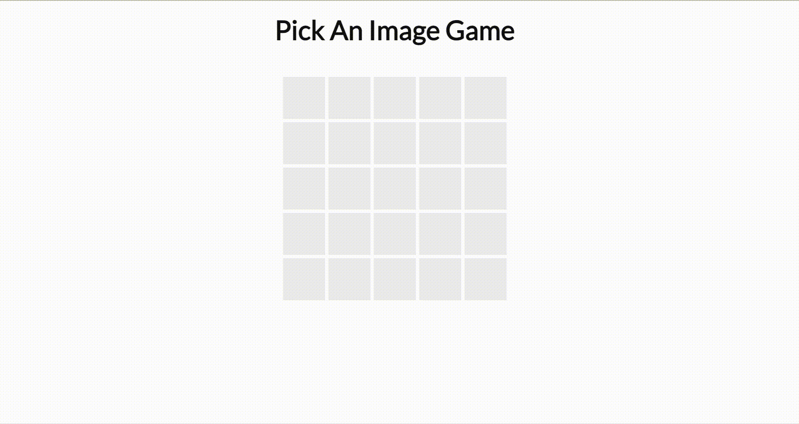

# Pick & Match Game Screenshot

# Pick & Match Game

This is a simple game board implementation using JavaScript, HTML, and CSS.

## Features

- 5x5 grid game board
- Randomly generated values ('x' or 'o') for each cell
- Click event listener on each cell to check for matches
- Disable clicked cells
- Display an alert when a match is found
- Reset the board after a match is found

## Getting Started

1. Clone the repository or download the source code.
2. Open the `index.html` file in a web browser.

## Code Structure

- `board`: The HTML element representing the game board.
- `rowCount` and `colCount`: Constants defining the number of rows and columns in the game board.
- `imageValue`: An array containing the values ('x' and 'o') used for generating random values in each cell.
- `resetBoard()`: A function that creates the game board and sets up the match checking mechanism.
- `generateRandomValue()`: A function that randomly generates either 'x' or 'o'.
- `createSquareBox()`: A function that dynamically creates the 5x5 grid of cells with random values.
- `checkForMatch()`: A function that adds a click event listener to each cell and handles the match checking logic.

## Dependencies

- None

## License

This project is licensed under the [MIT License](LICENSE).
