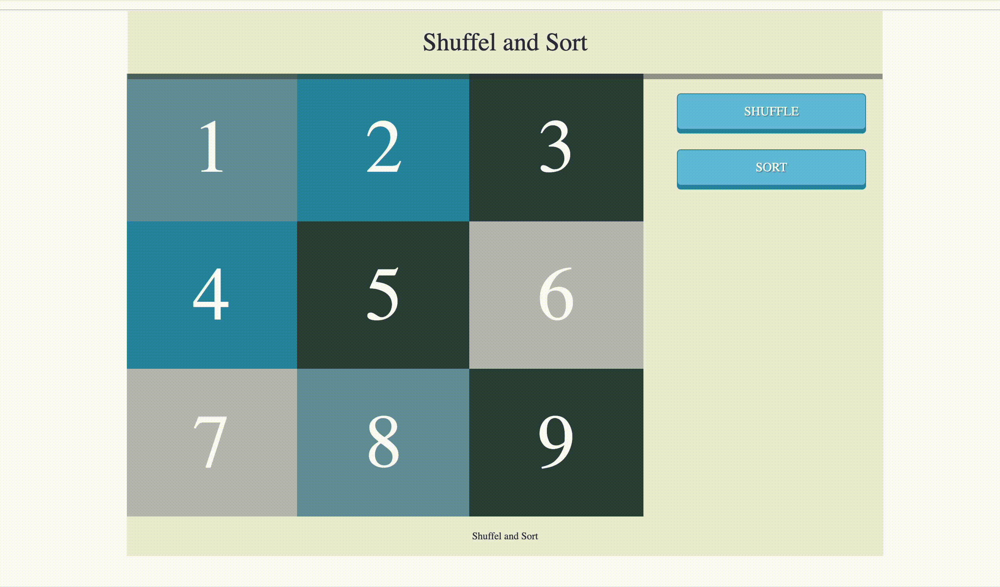

# Shuffle and Sort List Screenshot

# Shuffle and Sort List

This is a simple JavaScript implementation to shuffle and sort an unordered list (`<ul>`) on a web page.

## Features

- Shuffle the list items in a random order
- Sort the list items in alphabetical order based on their text content
- Separate buttons to trigger the shuffle and sort functionality

## Getting Started

1. Clone the repository or download the source code.
2. Open the `index.html` file in a web browser.
3. Click the "Shuffle" button to randomly shuffle the list items.
4. Click the "Sort" button to sort the list items in alphabetical order.

## Code Structure

- `window.onload`: The main function is executed when the window finishes loading.
- `shuffle(items)`: A function that takes an array as input and returns a new array with the items randomly shuffled.
- `shuffleNodes()`: A function that shuffles the list items in the `<ul>` element using the `shuffle` function.
- `sort(items)`: A function that takes an array as input and returns a new array with the items sorted in alphabetical order based on their text content.
- `sortNodes()`: A function that sorts the list items in the `<ul>` element using the `sort` function.
- Event listeners are added to the "Shuffle" and "Sort" buttons, which call the `shuffleNodes` and `sortNodes` functions, respectively, when clicked.

## Dependencies

- None

## License

This project is licensed under the [MIT License](LICENSE).
