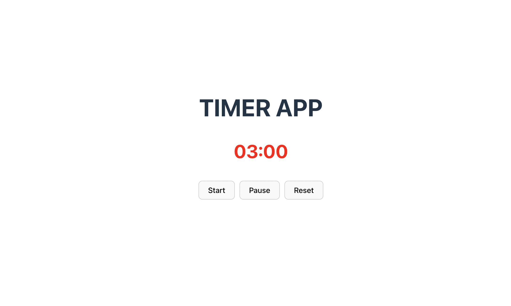

# Stopwatch App with React

# Vite React Starter

This is a starter project for building React applications using Vite as the build tool.

## Prerequisites

- Node.js (>=14.x)
- npm or yarn

## Getting Started

1. Clone the repository or download the source code.
2. Navigate to the project directory: `cd vite-react-starter`
3. Install dependencies: `npm install` or `yarn install`

## Available Scripts

In the project directory, you can run:

### `npm run dev` or `yarn dev`

Runs the app in development mode.\
Open [http://localhost:5173](http://localhost:5173) to view it in the browser.

The page will reload if you make edits.\
You will also see any lint errors in the console.

### `npm run build` or `yarn build`

Builds the app for production to the `dist` folder.\
It correctly bundles React in production mode and optimizes the build for the best performance.

The build is minified, and the filenames include the hashes.\
Your app is ready to be deployed!

### `npm run lint` or `yarn lint`

Runs ESLint for all JavaScript and JSX files in the project, reporting any lint errors or warnings found.

### `npm run preview` or `yarn preview`

Serves the production build locally for previewing.

## Dependencies

- React (^18.3.1)
- React DOM (^18.3.1)

## Development Dependencies

- @types/react (^18.3.1)
- @types/react-dom (^18.3.0)
- @vitejs/plugin-react (^4.2.1)
- ESLint (^8.57.0)
- eslint-plugin-react (^7.34.1)
- eslint-plugin-react-hooks (^4.6.2)
- eslint-plugin-react-refresh (^0.4.6)
- Vite (^5.2.10)

## License

This project is licensed under the [MIT License](LICENSE).
