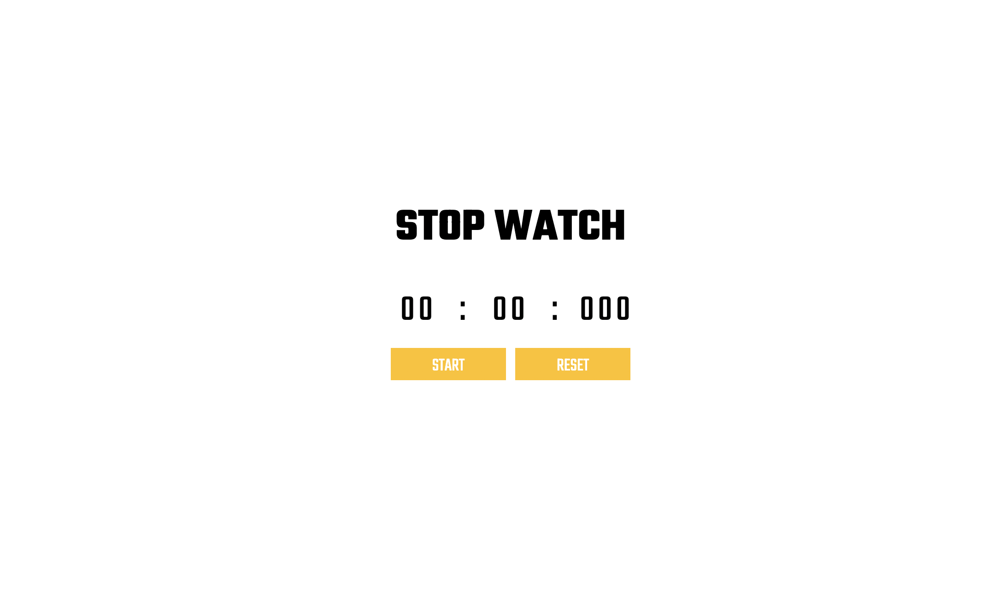

# Stopwatch App Screenshot

# Stopwatch React App

This is a React project for creating a stopwatch application.

## Prerequisites

- Node.js (>=12.x)
- npm or yarn

## Getting Started

1. Clone the repository or download the source code.
2. Navigate to the project directory: `cd stopwatch-app-react`
3. Install dependencies: `npm install` or `yarn install`

## Available Scripts

In the project directory, you can run:

### `npm start` or `yarn start`

Runs the app in development mode.\
Open [http://localhost:3000](http://localhost:3000) to view it in the browser.

The page will reload if you make edits.\
You will also see any lint errors in the console.

### `npm test` or `yarn test`

Launches the test runner in interactive watch mode.\
See the section about [running tests](https://facebook.github.io/create-react-app/docs/running-tests) for more information.

### `npm run build` or `yarn build`

Builds the app for production to the `build` folder.\
It correctly bundles React in production mode and optimizes the build for the best performance.

The build is minified, and the filenames include the hashes.\
Your app is ready to be deployed!

See the section about [deployment](https://facebook.github.io/create-react-app/docs/deployment) for more information.

## Dependencies

- @testing-library/jest-dom (^4.2.4)
- @testing-library/react (^9.5.0)
- @testing-library/user-event (^7.2.1)
- node-sass (^9.0.0)
- react (^16.13.1)
- react-dom (^16.13.1)
- react-scripts (^5.0.1)

## License

This project is licensed under the [MIT License](LICENSE).
