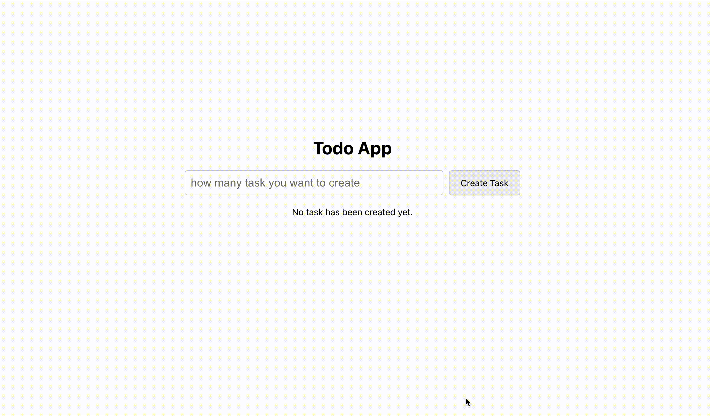

# Todo App Screenshot

# Todo App (React)

This is a React application that allows you to create random tasks and manage their status (Todo, In Progress, Completed) by clicking on them.

## Features

- Create a specified number of random tasks
- Display the list of tasks with their status (Todo, In Progress, Completed)
- Click on a task to cycle through its status (Todo -> In Progress -> Completed -> Todo)
- Tasks are color-coded based on their status (red for Todo, orange for In Progress, green for Completed)

## Getting Started

1. Clone the repository or download the source code.
2. Navigate to the project directory: `cd your-project-directory`
3. Install dependencies: `npm install`
4. Start the development server: `npm start`
5. Open [http://localhost:3000](http://localhost:3000) to view the app in the browser.

## Available Scripts

In the project directory, you can run:

### `npm start`

Runs the app in the development mode.\
Open [http://localhost:3000](http://localhost:3000) to view it in the browser.

The page will reload if you make edits.\
You will also see any lint errors in the console.

### `npm test`

Launches the test runner in the interactive watch mode.\
See the section about [running tests](https://facebook.github.io/create-react-app/docs/running-tests) for more information.

### `npm run build`

Builds the app for production to the `build` folder.\
It correctly bundles React in production mode and optimizes the build for the best performance.

The build is minified, and the filenames include the hashes.\
Your app is ready to be deployed!

See the section about [deployment](https://facebook.github.io/create-react-app/docs/deployment) for more information.

### `npm run eject`

**Note: this is a one-way operation. Once you `eject`, you can't go back!**

If you aren't satisfied with the build tool and configuration choices, you can `eject` at any time. This command will remove the single build dependency from your project.

Instead, it will copy all the configuration files and the transitive dependencies (webpack, Babel, ESLint, etc) right into your project so you have full control over them. All of the commands except `eject` will still work, but they will point to the copied scripts so you can tweak them. At this point, you're on your own.

You don't have to ever use `eject`. The curated feature set is suitable for small and middle deployments, and you shouldn't feel obligated to use this feature. However, we understand that this tool wouldn't be useful if you couldn't customize it when you are ready for it.

## Code Structure

- `Task` function: Defines a Task object with properties `id`, `title`, and `status`.
- `App` component:
  - `useState` hooks are used to manage the state of the number of tasks and the task list.
  - `generateRandomTask` function generates an array of random tasks based on the provided number.
  - `handleCreateTask` function sets the task list with the generated random tasks.
  - `taskClickHandler` function updates the status of a clicked task by cycling through the status loop.
  - The component renders an input field to specify the number of tasks, a button to create tasks, and a list of tasks with their status.

## Dependencies

- React (^16.13.1 or ^18.3.1)

## License

This project is licensed under the [MIT License](LICENSE).
